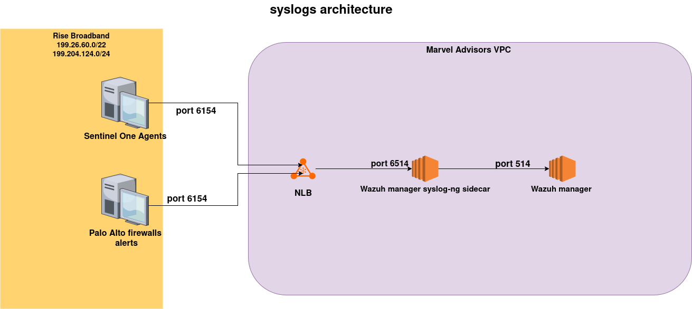
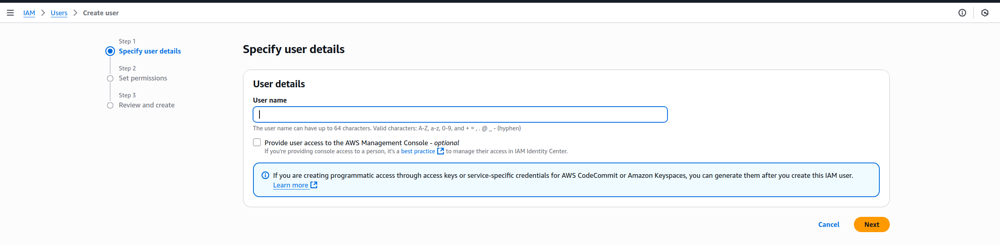
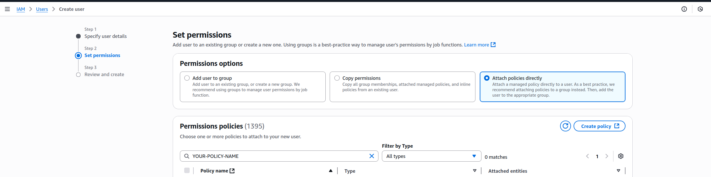
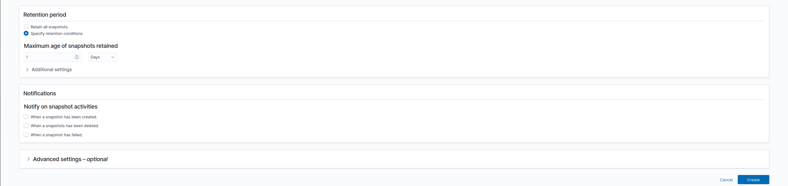

# Marvel Advisors Wazuh-dev Kubernetes

The purpose of this repository is for developing tests.
At the moment the only diference from the original wazuh, is that  
we are not using LoadBalancers only services with ClusterIP. We implemented syslog-ng for encrypt and decrypt syslog  
alerts that we receive from Rise Broadband. This repo is suposed to be deployed using the test-env-infra for the creation  
of the EKS cluster using terraform. After usage it must be destroyed. 

## Branches

* `master-dev` branch contains the code for wazuh 4.13.0 functional.  

## Documentation

## Amazon EKS development

To deploy a cluster on Amazon EKS cluster read the instructions on [instructions.md](instructions.md).
Note: For Kubernetes version 1.23 or higher, the assignment of an IAM Role is necessary for the CSI driver to function correctly. Within the AWS documentation you can find the instructions for the assignment: https://docs.aws.amazon.com/eks/latest/userguide/ebs-csi.html
The installation of the CSI driver is mandatory for new and old deployments if you are going to use Kubernetes 1.23 for the first time or you need to upgrade the cluster.

## Local development

To deploy a cluster on your local environment (like Minikube, Kind or Microk8s) read the instructions on [local-environment.md](local-environment.md).


## How to connect to dashboard

You'll need one of the cluster nodes IP's to connect to the dashboard, you can get the IP like this: 
```bash
$ kubectl get nodes -o wide
NAME                                         STATUS   ROLES    AGE   VERSION               INTERNAL-IP    EXTERNAL-IP     OS-IMAGE                       KERNEL-VERSION                   CONTAINER-RUNTIME
ip-10-0-104-85.us-east-2.compute.internal    Ready    <none>   53m   v1.33.5-eks-113cf36   10.0.104.85    3.15.16.178     Amazon Linux 2023.9.20250929   6.12.46-66.121.amzn2023.x86_64   containerd://1.7.27
ip-10-0-126-132.us-east-2.compute.internal   Ready    <none>   53m   v1.33.5-eks-113cf36   10.0.126.132   18.191.146.49   Amazon Linux 2023.9.20250929   6.12.46-66.121.amzn2023.x86_64   containerd://1.7.27
ip-10-0-77-13.us-east-2.compute.internal     Ready    <none>   53m   v1.33.5-eks-113cf36   10.0.77.13     3.149.242.52    Amazon Linux 2023.9.20250929   6.12.46-66.121.amzn2023.x86_64   containerd://1.7.27
ip-10-0-85-146.us-east-2.compute.internal    Ready    <none>   53m   v1.33.5-eks-113cf36   10.0.85.146    3.146.37.209    Amazon Linux 2023.9.20250929   6.12.46-66.121.amzn2023.x86_64   containerd://1.7.27
```
Copy one of the `EXTERNAL-IP` values and open it in your browser, for example:
```js
https://3.15.16.178:32080 
```

We use port 32080 for the dashboard. If the page doesn't load, you may need to open port 32080 in the security group (SG).

Because we don't beed a trusted SSL certificate on this enviroment, your browser will show a warning — accept it to proceed.


## Credentials for dashboard   

```yaml
user: admin
password: SecretPassword
```

## Directory structure

    ├── CHANGELOG.md
    ├── cleanup.md
    ├── images
    ├── envs
    │   ├── eks
    │   │   ├── dashboard-resources.yaml
    │   │   ├── indexer-resources.yaml
    │   │   ├── kustomization.yml
    │   │   ├── storage-class.yaml
    │   │   ├── wazuh-master-resources.yaml
    │   │   └── wazuh-worker-resources.yaml
    │   └── local-env
    │       ├── indexer-resources.yaml
    │       ├── kustomization.yml
    │       ├── storage-class.yaml
    │       └── wazuh-resources.yaml
    ├── instructions.md
    ├── LICENSE
    ├── local-environment.md
    ├── README.md
    ├── upgrade.md
    ├── VERSION.json
    └── wazuh
        ├── base
        │   ├── storage-class.yaml
        │   └── wazuh-ns.yaml
        ├── certs
        │   ├── dashboard_http
        │   │   └── generate_certs.sh
        │   └── indexer_cluster
        │       └── generate_certs.sh
        ├── indexer_stack
        │   ├── wazuh-dashboard
        │   │   ├── dashboard_conf
        │   │   │   └── opensearch_dashboards.yml
        │   │   ├── dashboard-deploy.yaml
        │   │   └── dashboard-svc.yaml
        │   └── wazuh-indexer
        │       ├── cluster
        │       │   ├── indexer-api-svc.yaml
        │       │   └── indexer-sts.yaml
        │       ├── indexer_conf
        │       │   ├── internal_users.yml
        │       │   └── opensearch.yml
        │       └── indexer-svc.yaml
        ├── kustomization.yml
        ├── secrets
        │   ├── dashboard-cred-secret.yaml
        │   ├── indexer-cred-secret.yaml
        │   ├── wazuh-api-cred-secret.yaml
        │   ├── wazuh-authd-pass-secret.yaml
        │   └── wazuh-cluster-key-secret.yaml
        └── wazuh_managers
            ├── wazuh-cluster-svc.yaml
            ├── wazuh_conf
            │   ├── syslog-ng-secrets
            │   │   ├── ca.yaml
            │   │   ├── tlscrt.yaml
            │   │   ├── tlskey.yaml
            │   ├── master.conf
            │   ├── entrypoint-syslog-cm.yaml
            │   ├── syslog-ng-cm.yaml
            │   └── worker.conf
            ├── wazuh-master-sts.yaml
            ├── wazuh-master-svc.yaml
            ├── wazuh-workers-svc.yaml
            └── wazuh-worker-sts.yaml

## Syslog-ng architecture and network

We use syslog-ng for encrypt and decrypt syslog messages comming from Rise Broadband, currently we're receiving SentinelOne and Palo Alto firewall alerts from syslog. Bellow you can see the diagram of  
how it works:  
  


## Wazuh Indexer S3 Snapshots Configuration

This section documents the configuration steps required to enable Wazuh Indexer (based on OpenSearch) to create and store snapshots in an AWS S3 bucket.

### 1. Create the S3 bucket
Create a bucket on AWS without any special config, just the defaults

### 2. Create IAM Policy for S3 Snapshots

In AWS IAM, create a new policy (e.g., `Wazuh-S3-Snapshot-Policy`) with the following JSON content (replace the bucket name with the one created on the 1st step):

```json
{
    "Version": "2012-10-17",
    "Statement": [
        {
            "Effect": "Allow",
            "Action": [
                "s3:GetBucketLocation",
                "s3:ListBucket",
                "s3:ListBucketMultipartUploads",
                "s3:ListBucketVersions"
            ],
            "Resource": [
                "arn:aws:s3:::<REPLACE-WITH-YOUR-S3-BUCKET-NAME>"
            ]
        },
        {
            "Effect": "Allow",
            "Action": [
                "s3:AbortMultipartUpload",
                "s3:DeleteObject",
                "s3:GetObject",
                "s3:ListMultipartUploadParts",
                "s3:PutObject"
            ],
            "Resource": [
                "arn:aws:s3:::<REPLACE-WITH-YOUR-S3-BUCKET-NAME>/*"
            ]
        }
    ]
}
```    
### 3. Create IAM User with Programmatic Access 
#### a) Go to IAM on AWS and click on users -> ceate a new user   
  
select a name and `DO NOT` select the "Provide user access to...", then hit next  

#### b) Select the permissions options 'Attach policies directly' 
 
here you're gonna type your policy name created on the [step 2](#2-create-iam-policy-for-s3-snapshots) 

#### c) Review the details of the users, and if everything it is okay, hit create, then go to the user and click on 'Security Credentials' scroll down til you find access key section, hit create access key
 

select the option `Application running on an AWS compute service`  

  
then hit create, and copy those credentials, you'll need them on the next step. 

### 1. Install the `repository-s3` plugin on indexer pods and set the `AWS_ACCES_KEY_ID` and `AWS_SECRET_ACCES_KEY_ID`
We do the configurations using the `command` of the indexer container (`indexer-sts.yaml`):

```yaml
          command:  #Install the S3 plugin if not installed yet, then start normally
            - sh
            - -c
            - |
            # 

            # The following checks if the repository-s3 plugin is not installed before proceeding     
              if ! /usr/share/wazuh-indexer/bin/opensearch-plugin list | grep -q repository-s3; then
                echo "Installing repository-s3 plugin..."
                echo "y" | /usr/share/wazuh-indexer/bin/opensearch-plugin install repository-s3
              fi

              # Create keystore if not exist
              if [ ! -f /usr/share/wazuh-indexer/opensearch.keystore ] || ! /usr/share/wazuh-indexer/bin/opensearch-keystore list > /dev/null 2>&1; then
                  echo "Creating OpenSearch keystore..."
                  /usr/share/wazuh-indexer/bin/opensearch-keystore create
              fi              

              if ! /usr/share/wazuh-indexer/bin/opensearch-keystore list | grep -q s3.client.default.access_key; then
                echo -n "$AWS_ACCESS_KEY_ID" | /usr/share/wazuh-indexer/bin/opensearch-keystore add s3.client.default.access_key --stdin
              fi
              if ! /usr/share/wazuh-indexer/bin/opensearch-keystore list | grep -q s3.client.default.secret_key; then
                echo -n "$AWS_SECRET_ACCESS_KEY" | /usr/share/wazuh-indexer/bin/opensearch-keystore add s3.client.default.secret_key --stdin
              fi   
            
              # Set correct perms and owner
              chown wazuh-indexer:wazuh-indexer /usr/share/wazuh-indexer/opensearch.keystore
              chmod 660 /usr/share/wazuh-indexer/opensearch.keystore


              # Start original entrypoint
              exec /usr/share/wazuh-indexer/bin/systemd-entrypoint     
          #Rest of the code bellow             
          ports:
            - containerPort: 9200
              name: indexer-rest
            - containerPort: 9300
              name: indexer-nodes
```
### Check everything it's  properly configured

#### 1) Connect to wazuh indexer :  

`kubectl exec -it wazuh-indexer-0 -n wazuh -- /bin/bash`  

#### 2) Check if the keys are properly mounted:  
```bash 
bash-5.2$ /usr/share/wazuh-indexer/bin/opensearch-keystore list
keystore.seed
s3.client.default.access_key
s3.client.default.secret_key
bash-5.2$ 
```
you can't see the content of the keys, but you can try creating a snapshot repositorie, if you can create it then the keys are OK.  

#### 3) Go to Wazuh - > Index Management -> Repositories and click on 'Create Repositorie'
  

you need to put a repo name, your s3 bucket name and region AWS region (e.g us-east-1). Here's the code: 

```json
{
    "type": "s3",
    "settings": {
        "bucket": "<YOUR-S3-BUCKET-NAME>",
        "base_path": "wazuhsnapshots",
        "region": "<YOUR-AWS-REGION>"
    }
}
```
Note: `base_path` is a subdirectory within your S3 bucket, you can name it however you want.

#### 4) Create the Snapshot Policy 
In the same section (Index Managament) go to `Snapshots Policy` and click on create a new one  

   

 select a `Policy Name` and `Description`. `Source and destination` select the indexes you want to use for your snapshots (you have to type it), e.g:  
 ``` bash
 wazuh-alerts-4.x-*
 ```  

 the destination will be the repo you just created on the previous step, or if you want you can create the repo right there clicking on the `Create repository` buttom at the right.  
 Next set the snapshot frequency you need.  

 
next click on `Specify retention conditions` and select the time you want to have those snapshots on S3 before deleting them forever. Finally click on `Create`.  

#### 5) Restoring a snapshot  

Go to `Snapshots`, select your snapshots and click on `restore`, then you'll need to select if you want to restore all the indexes or just a set of them. You'll need to have an account with snapshots permissions for this step.


## License and copyright

WAZUH
Copyright (C) 2016, Wazuh Inc.  (License GPLv2)

## References

* [Wazuh website](http://wazuh.com)

## Wazuh media: 
[](https://wazuh.com/community/join-us-on-slack/)
[](https://groups.google.com/forum/#!forum/wazuh)
[](https://documentation.wazuh.com)
[](https://wazuh.com)
